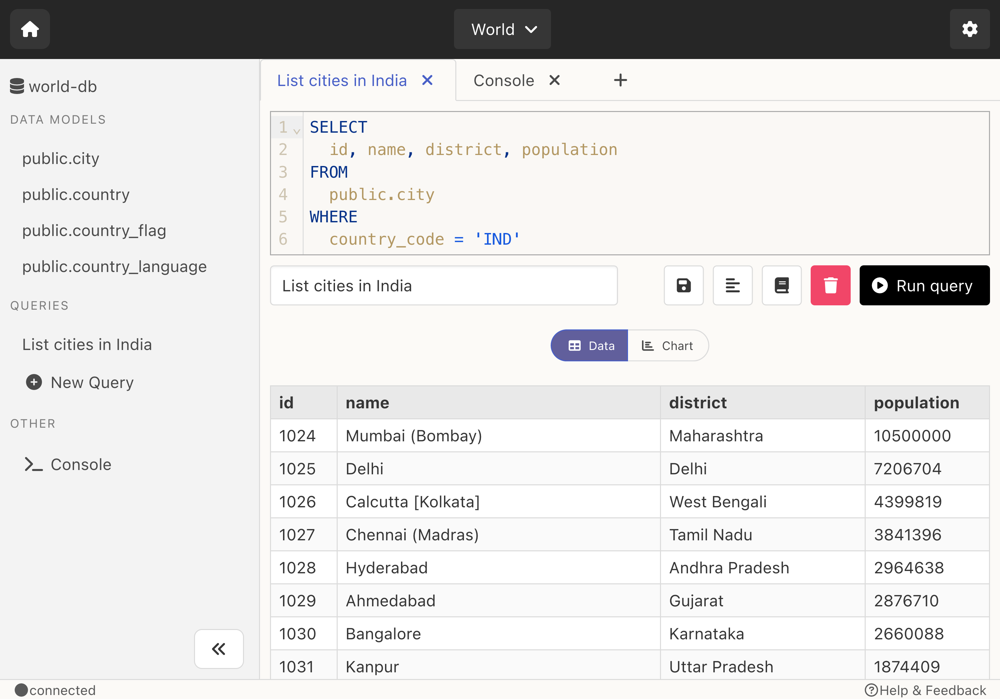

# Introduction

Slashbase is a modern open-source database IDE for your dev/data workflows. Use Slashbase to connect to any of your database, browse data and schema, write, run and save queries, create charts.

Currently works with MySQL, PostgreSQL & MongoDB database. More databases will be supported in the future.

# Features

- **🧑‍💻 Desktop App**: Use the IDE as a standalone desktop app.
- **🪄 Modern Interface**: With a modern interface, it is easy to use.
- **🪶 Lightweight**: Doesn't take much space on your system.
- **⚡️ Quick Browse**: Quickly filter, sort & browse data and schema with a low-code UI.
- **💾 Save Queries**: Write and Save queries to re-run in the future.
- **📊 Create Charts**: Create charts from your query results.
- **📺 Console**: Run commands like you do in the terminal.
- **🗂 Projects**: Organise all database connections into various projects.
- **📕 Query Cheatsheets**: Search and view query commands syntax right inside the IDE.
- **✅ Database Support**: MySQL, PostgreSQL and MongoDB.

Slashbase is available in two type of builds:
- Slashbase Desktop
- Slashbase Server

Both desktop and server builds can be compiled from the same open-source codebase. Look at their specific doc pages to know more.